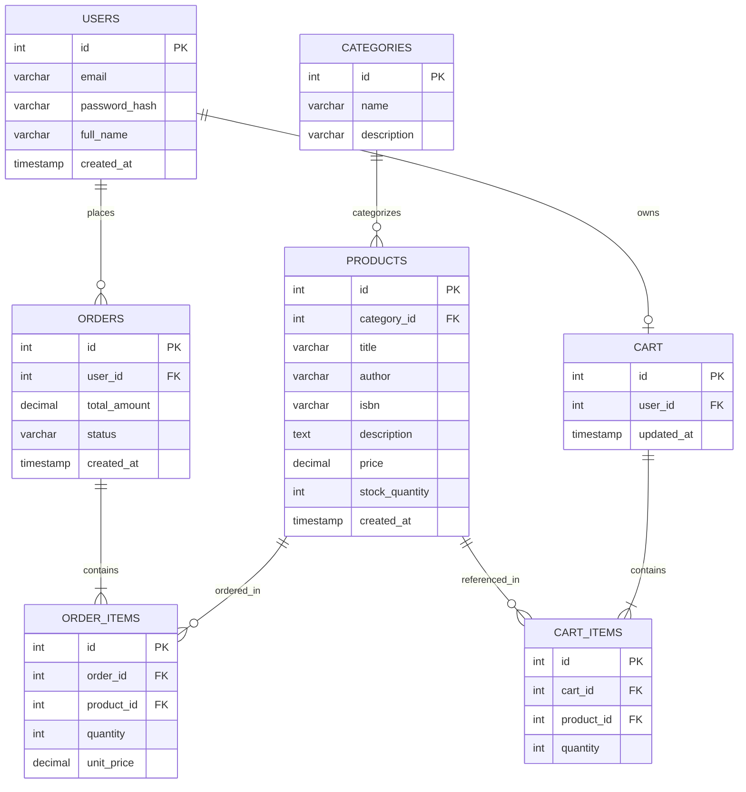

# Sprint 1: System Architecture & Scope Definition

## Section 1: Target Audience & Market Focus

- **Primary Persona:** Casual and avid readers aged 18–40 looking for an easy way to browse, discover, and buy new and second-hand books online, without wading through a generic marketplace's unrelated listings.
- **Core Pain Point:** General e-commerce platforms don't offer book-specific discovery (by genre, author, or series) and often mix books with unrelated products, making it hard to browse a focused catalog and track orders for a specific title or series.
- **Domain Scope:** Books & Literature (a focused vertical: fiction, non-fiction, and academic titles, organized by genre/author/category).

## Section 2: MVP Feature Scope

| Category | Feature Name | Description | Priority |
|---|---|---|---|
| Authentication | User Registration & Authentication | Password hashing and PHP session-based authentication for signup/login. | High (MVP) |
| Catalog | Product List & Search | Book browsing interface with genre/author/category-based filtering and keyword search. | High (MVP) |
| Cart | Cart Management | Persistent server-side cart (MySQL-backed) supporting item addition, quantity updates, and removal. | High (MVP) |
| Checkout | Order Processing | Mock payment gateway integration and order record creation in MySQL. | High (MVP) |
| Admin | Inventory Control | Administrative CRUD operations for book listings and stock management. | Medium |
| Account | Order History | Authenticated users can view past orders and current order status. | Medium |

## Section 3: Tech Stack Selection & Justification

- **Frontend: HTML, CSS, JavaScript**
  Justification: For a catalog-and-checkout book shop, plain HTML/CSS/JS keeps the frontend lightweight and directly compatible with server-rendered PHP pages, avoiding the build-tooling overhead of a JS framework that isn't needed at this project's scale.

- **Backend Infrastructure: PHP**
  Justification: PHP integrates natively with MySQL and standard web hosting environments, has a low setup barrier, and is well-suited to server-rendered pages (product listings, cart, checkout) without requiring a separate API layer.

- **Database Management System: MySQL**
  Justification: The domain (users, books, orders, order items) is relational with clear referential integrity needs (an order item must reference a valid order and book), and MySQL pairs naturally with PHP's built-in database extensions (mysqli/PDO).

- **Alternative Platform Option: WordPress (with WooCommerce)**
  Justification: As an alternative to a custom PHP/MySQL build, WordPress + WooCommerce provides built-in product catalog, cart, and checkout functionality out of the box, trading some customization flexibility for significantly faster setup — worth considering if development time is more constrained than the need for a fully custom codebase.

- **Caching & Asynchronous Processing (Optional):** Not required for MVP scope; can be revisited in a later sprint if catalog size or traffic grows (e.g., MySQL query caching or a simple file-based cache for book listings).

## Section 4: Entity-Relationship Diagram (ERD)

**Relationship & Cardinality Notes:**
- `USERS (1) — (N) ORDERS`: one user can place many orders; each order belongs to exactly one user.
- `USERS (1) — (0..1) CART`: each user has at most one active cart.
- `ORDERS (1) — (N) ORDER_ITEMS`: each order contains one or more order items; each order item belongs to exactly one order.
- `PRODUCTS (1) — (N) ORDER_ITEMS`: a book can appear in many order items across different orders; each order item references exactly one book.
- `CATEGORIES (1) — (N) PRODUCTS`: a category (genre) groups many books; each book belongs to exactly one primary category.
- `CART (1) — (N) CART_ITEMS`: a cart holds many cart items; each cart item belongs to exactly one cart.
- `PRODUCTS (1) — (N) CART_ITEMS`: a book can appear in many cart items across different users' carts.
- **N:M relationships** (Orders↔Books via `ORDER_ITEMS`, and Cart↔Books via `CART_ITEMS`) are resolved using associative entities carrying their own PK plus FKs to both sides, along with transactional attributes (`quantity`, `unit_price`).

**PHP/MySQL Implementation Note:** All PKs are `INT AUTO_INCREMENT`, all FKs use `ON DELETE CASCADE` or `ON DELETE RESTRICT` as appropriate (e.g., restrict deleting a book referenced by existing order items), and `isbn` on `PRODUCTS` should carry a `UNIQUE` constraint.